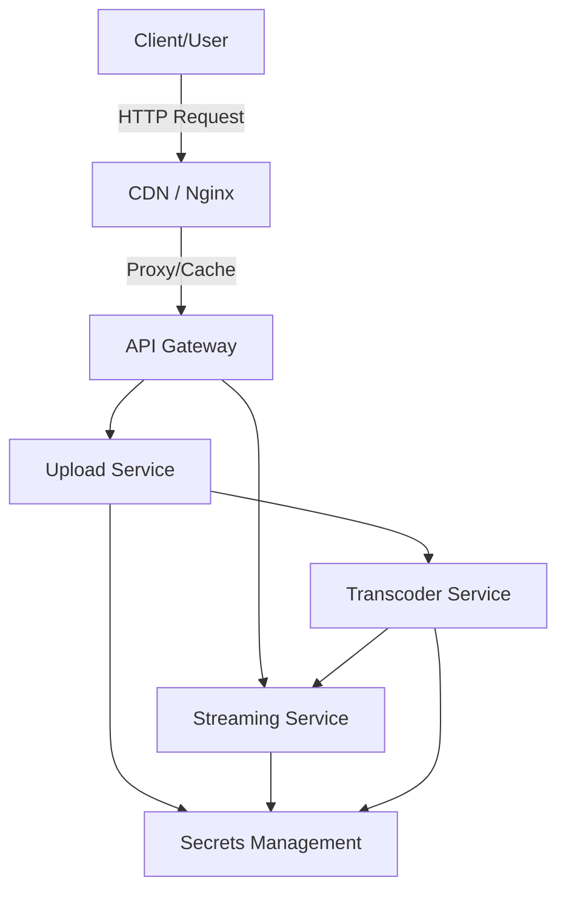

# Project Description

This project is a microservices-based video management system designed to address the challenges of scalable, secure, and efficient video handling for modern applications. Its purpose is to enable seamless video upload, streaming, and transcoding, while ensuring robust security and maintainability.

The system solves several key problems:
- **Scalability**: By splitting functionality into independent services, the platform can handle increased load and scale horizontally.
- **Security**: Implements secure authentication, signed URLs, and secret management to protect user data and video assets.
- **Flexibility**: Supports multiple deployment options (Docker, Kubernetes) and can be extended for cloud or on-premise use.
- **Performance**: Real-time streaming and automated transcoding optimize video delivery for different devices and network conditions.

# Microservice Architecture & Project Summary

## Architecture Diagram



**Legend:**
- Client interacts with CDN (Nginx), which proxies requests to the API Gateway.
- API Gateway routes requests to Upload and Streaming services.
- Upload Service manages uploads and triggers transcoding.
- Transcoder Service processes videos and interacts with Streaming Service.
- Secrets Management is used by all services for secure credentials.
# Installation Instructions

1. **Clone the repository:**
	```powershell
	git clone https://github.com/ritik0525/Microservice.git
	cd Microservice
	```

2. **Edit secrets:**
	- Update `security.jwt.secret` and `signedurl.secret` in:
	  - `upload-service/src/main/resources/application.properties`
	  - `streaming-service/src/main/resources/application.properties`
	- Or set environment variables in `docker-compose.yml`.

3. **Build and run with Docker Compose:**
	```powershell
	docker-compose up --build
	```

4. **(Optional) Kubernetes deployment:**
	- Use the YAML files in the `k8s/` directory for cloud or cluster deployment.

# Usage Instructions

## Authentication
Request a JWT token:
```http
POST http://localhost:8081/auth/login
Body: { "username": "admin", "password": "password" }
```
Response:
```json
{ "token": "<JWT token>" }
```

## Upload a Video
```http
POST http://localhost:8081/api/videos/upload
Headers: Authorization: Bearer <token>
Form field: file=@/path/to/video.mp4
```

## Check Video Status
```http
GET http://localhost:8081/api/videos/{id}/status
Headers: Authorization: Bearer <token>
```

## Request a Signed URL for Streaming
```http
POST http://localhost:8081/api/videos/{id}/signed-url?type=hls
Headers: Authorization: Bearer <token>
```
Response:
```json
{ "url": "http://localhost:8084/stream/hls/{id}/hls_master.m3u8?expires=...&sig=..." }
```

## Play the Video
Use the signed URL in your video player. Requests go through the CDN (nginx) at `http://localhost:8084` and are validated by the streaming service.

## Architecture Overview

This project is designed using a microservices architecture, where each core functionality is separated into independent services. The main components include:

- **Video Streaming Service**: Handles video streaming operations and serves video content to users.
- **Upload Service**: Manages video uploads, user authentication, and metadata storage.
- **Transcoder Service**: Responsible for transcoding uploaded videos into different formats and resolutions.
- **API Gateway (nginx)**: Routes requests to the appropriate microservice and provides a single entry point for clients.
- **Secrets Management**: Uses Docker secrets and Kubernetes secrets for secure management of sensitive data.
- **Orchestration**: Docker Compose and Kubernetes YAML files are provided for local and cloud deployments.

Each service is built with Spring Boot (Java) and communicates via REST APIs. The architecture supports scalability, maintainability, and independent deployment of services.

## Project Summary

This microservices-based video management system enables users to upload, stream, and transcode videos efficiently. Key features include:

- Secure video upload and authentication
- Real-time video streaming
- Automated video transcoding
- Centralized API gateway for routing
- Containerized deployment with Docker and Kubernetes
- Secure handling of secrets and credentials

The project is ideal for scalable video platforms, educational portals, or any application requiring robust video management capabilities.